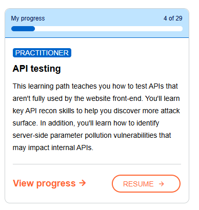

# 0x00 :: PortSwigger Web Security Academy — Progress Log

---

## 0x01 :: Progress Summary

| Category                | Value             |
|-------------------------|-------------------|
| Current Level           | NEWBIE            |
| Labs to Apprentice      | 39                |
| Labs Completed (Appr.)  | 20 / 59           |
| Labs Completed (Pract.) | 20 / 171          |
| Labs Completed (Expert) | 0 / 39            |

---

## 0x02 :: Certification Status

Exam Readiness: **NOT READY**  
Requirements (Practitioner level labs and up):

| Segment                  | Progress       |
|--------------------------|----------------|
| Labs from all topics     | 5 / 23          |
| Specific labs            | 3 / 8           |
| Mystery labs             | 0 / 5           |
| Practice exam            | 0 / 1           |

---

## 0x03 :: Completed Modules

| Module                     | Status       | Screenshot File              |
|----------------------------|--------------|------------------------------|
| Server-side vulnerabilities| 52 / 52 DONE |        |
| SQL Injection          | 51 / 51 DONE     |                |
| File Upload            | 35 / 35 DONE     |         |

---

## 0x04 :: In Progress

| Module                 | Status       | Screenshot File              |
|------------------------|--------------|------------------------------|
| API Testing            | 4 / 29       |         |
| WEB LLM attacks            | 9 / 17       |         |

---

## 0x05 :: Pending Modules

```
[0%]  CSRF
[0%]  Clickjacking
[0%]  GraphQL API vulnerabilities
[0%]  CORS
[0%]  NoSQL injection
[0%]  Race conditions
[0%]  Authentication vulnerabilities
[0%]  SSRF
[0%]  Prototype pollution
[0%]  Path traversal
[0%]  WebSockets vulnerabilities
[0%]  Web cache deception
```
---

## 0xFF :: Get Certified?
